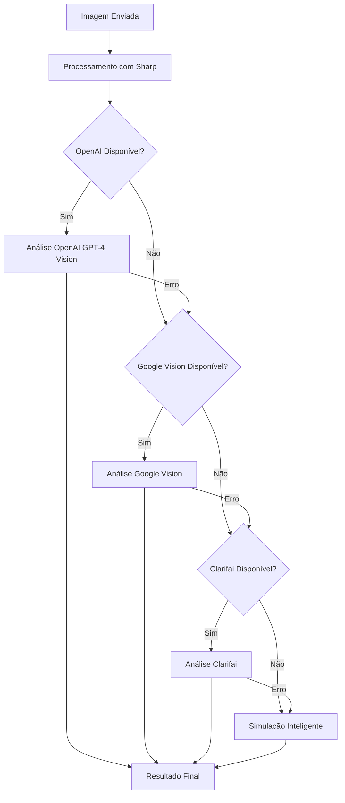

# 🤖 Configuração de IA para Análise Nutricional

Este documento explica como configurar as APIs de IA para análise de imagens de comida no sistema fitness.

## 🚀 APIs Suportadas

O sistema utiliza múltiplas APIs de IA em cascata para garantir a melhor precisão possível:

### 1. **OpenAI GPT-4 Vision** (Recomendado - Mais Preciso)
- **Precisão**: ⭐⭐⭐⭐⭐
- **Custo**: Médio-Alto
- **Vantagens**: Análise muito detalhada, entende contexto, gera dicas personalizadas
- **Como obter**: [OpenAI Platform](https://platform.openai.com/api-keys)

### 2. **Google Vision API**
- **Precisão**: ⭐⭐⭐⭐
- **Custo**: Médio
- **Vantagens**: Excelente detecção de objetos, rápida
- **Como obter**: [Google Cloud Console](https://console.cloud.google.com/)

### 3. **Clarifai Food Model**
- **Precisão**: ⭐⭐⭐⭐
- **Custo**: Baixo-Médio
- **Vantagens**: Especializada em comida, boa detecção de ingredientes
- **Como obter**: [Clarifai](https://www.clarifai.com/)

### 4. **Spoonacular API**
- **Precisão**: ⭐⭐⭐
- **Custo**: Baixo
- **Vantagens**: Base de dados nutricional extensa
- **Como obter**: [Spoonacular](https://spoonacular.com/food-api)

## ⚙️ Configuração

### 1. Copie o arquivo de exemplo:
```bash
cp .env.example .env
```

### 2. Configure as chaves no arquivo `.env`:
```bash
# Pelo menos uma das APIs abaixo (recomendado: OpenAI)
OPENAI_API_KEY=sk-your-openai-key-here
GOOGLE_VISION_API_KEY=your-google-vision-key-here
CLARIFAI_API_KEY=your-clarifai-key-here
SPOONACULAR_API_KEY=your-spoonacular-key-here
```

### 3. Reinicie o servidor:
```bash
npm run dev
```

## 🔄 Como Funciona o Sistema de Cascata



## 📊 Exemplos de Resultados

### Com OpenAI GPT-4 Vision:
```json
{
  "food_name": "Poke Bowl com Salmão e Abacate",
  "confidence": 0.95,
  "calories": 520,
  "protein": 30,
  "carbohydrates": 55,
  "fat": 18,
  "fiber": 6,
  "analysis_method": "openai_gpt4_vision",
  "tips": [
    "Excelente fonte de ômega-3 do salmão",
    "O abacate fornece gorduras saudáveis",
    "Rica em proteínas para recuperação muscular"
  ]
}
```

### Com Google Vision:
```json
{
  "food_name": "Prato com rice, fish, vegetable",
  "confidence": 0.82,
  "calories": 485,
  "protein": 28,
  "carbohydrates": 52,
  "fat": 16,
  "analysis_method": "google_vision",
  "detected_objects": ["rice", "fish", "vegetable", "bowl"]
}
```

### Simulação Inteligente (Fallback):
```json
{
  "food_name": "Prato Misto Detectado",
  "confidence": 0.75,
  "calories": 450,
  "protein": 25,
  "carbohydrates": 45,
  "fat": 15,
  "analysis_method": "intelligent_simulation",
  "image_characteristics": {
    "dominant_color": {"r": 150, "g": 120, "b": 100},
    "brightness": 180,
    "detected_type": "mixed"
  }
}
```

## 💰 Custos Estimados

### OpenAI GPT-4 Vision:
- **Custo**: ~$0.01-0.03 por imagem
- **Limite gratuito**: $5 de crédito inicial
- **Recomendado para**: Produção com alta precisão

### Google Vision:
- **Custo**: ~$0.0015 por imagem
- **Limite gratuito**: 1.000 imagens/mês
- **Recomendado para**: Volume médio

### Clarifai:
- **Custo**: ~$0.002 per imagem
- **Limite gratuito**: 5.000 imagens/mês
- **Recomendado para**: Desenvolvimento e testes

### Spoonacular:
- **Custo**: ~$0.0011 por requisição
- **Limite gratuito**: 150 requisições/dia
- **Recomendado para**: Base de dados nutricional

## 🧪 Testando as APIs

Execute o teste com diferentes configurações:

```bash
# Teste completo (todas as APIs)
node test_ai_apis.js

# Teste apenas OpenAI
ONLY_OPENAI=true node test_ai_apis.js

# Teste sem APIs (apenas simulação)
NO_AI_APIS=true node test_ai_apis.js
```

## 🚨 Troubleshooting

### Erro de Autenticação:
```
Error: Unauthorized API request
```
**Solução**: Verifique se as chaves estão corretas no arquivo `.env`

### Erro de Cota:
```
Error: API quota exceeded
```
**Solução**: Verifique os limites da sua conta ou faça upgrade do plano

### Todas as APIs Falharam:
```
Warning: All AI APIs failed, using intelligent simulation
```
**Solução**: O sistema continuará funcionando com simulação. Verifique as configurações das APIs.

## 📈 Monitoramento

O sistema inclui logs detalhados para monitoramento:

```javascript
// Logs incluem:
- API utilizada
- Tempo de resposta
- Confiança do resultado
- Falhas e fallbacks
- Características da imagem processada
```

## 🔒 Segurança

- ✅ Chaves de API em variáveis de ambiente
- ✅ Validação de tipos de arquivo
- ✅ Limite de tamanho de imagem
- ✅ Rate limiting por usuário
- ✅ Processamento seguro com Sharp

## 📚 Próximos Passos

1. **Implementar cache**: Evitar reprocessamento de imagens similares
2. **Treinamento personalizado**: Modelo específico para pratos brasileiros
3. **Análise de vídeo**: Suporte para vídeos curtos
4. **OCR**: Leitura de informações nutricionais em embalagens
5. **Integração com wearables**: Dados de consumo automático